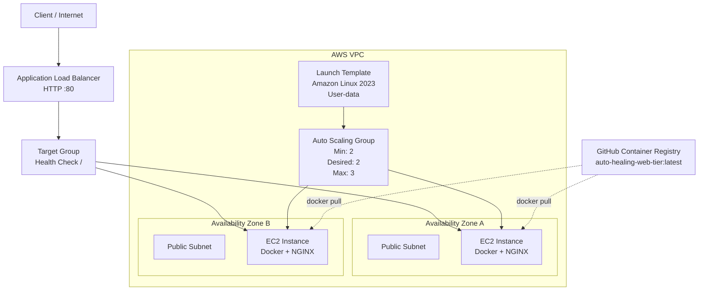

# Auto-Healing Web Tier

I built this as a Terraform-based AWS web tier that can automatically recover if one of the web instances is terminated.

The setup uses an Application Load Balancer, an Auto Scaling Group with two EC2 instances, health checks and a Launch Template.

I also completed the Docker bonus. The NGINX page is containerised, pushed to GitHub Container Registry, and pulled automatically by each new instance through user-data.

For testing, I used Floci locally so I could build and test the whole setup without paying for AWS resources.

---

## What This Covers

| Requirement | What I did |
|---|---|
| Self-healing | Auto Scaling Group replaces terminated instances automatically |
| IaC only | Everything is created through Terraform |
| Idempotency | A second Terraform plan returns no changes |
| N+1 capacity | Two web instances are kept behind an Application Load Balancer |
| Static web page | NGINX serves a simple static page |
| Terraform | Terraform 1.16.0 with AWS provider 6.x |
| Docker bonus | NGINX page is containerised and pushed to GHCR |
| Automatic bootstrap | User-data installs Docker, pulls the image and starts the container |
| Pipeline | GitHub Actions runs Terraform formatting, init and validation checks |
| Commit history | The project was built using incremental commits |

---

## Why I Chose AWS

I considered both AWS and Azure for this assessment.

Azure could do the same thing using Virtual Machine Scale Sets with Azure Load Balancer or Application Gateway, so I did not choose AWS because Azure could not meet the requirements.

I chose AWS because the Auto Scaling, Load Balancer and Launch Template services matched what I needed for the task.

The Application Load Balancer gives me one entry point and only sends traffic to healthy targets.

The Auto Scaling Group keeps the required number of instances running and creates a replacement if one is terminated.

The Launch Template makes sure every new instance is created using the same configuration.

The main downside is cost. The Application Load Balancer has a fixed hourly charge, which makes the AUD 20 monthly target difficult at normal AWS pricing.

For this assessment, I preferred AWS because the service model matched the requirements closely and let me keep the design focused on resilience, repeatability and testing.

---

## Architecture



The VPC has two public subnets in separate Availability Zones.

The Auto Scaling Group is configured with both subnets and keeps two instances running.

The Application Load Balancer listens on port 80 and forwards traffic to healthy instances in the Target Group.

The web-instance security group only allows HTTP traffic from the ALB security group, so the EC2 instances are not open directly to the internet on port 80.

---

## Repository Structure

```text
auto-healing-web-tier/
│
├── .github/
│   └── workflows/
│       ├── docker-publish.yml
│       └── terraform.yml
│
├── docker/
│   ├── Dockerfile
│   └── index.html
│
├── modules/
│   ├── network/
│   ├── load-balancer/
│   └── web-tier/
│
├── user-data/
│   └── nginx.sh
│
├── main.tf
├── providers.tf
├── variables.tf
├── outputs.tf
├── versions.tf
└── README.md
```

### Network module

Creates:

- VPC
- Internet Gateway
- two public subnets
- public route table
- route table associations

### Load balancer module

Creates:

- Application Load Balancer
- ALB security group
- web security group
- Target Group
- HTTP listener
- health checks

### Web tier module

Creates:

- Amazon Linux 2023 Launch Template
- user-data configuration
- Auto Scaling Group
- Target Group attachment
- desired capacity of two instances

---

# Running Against AWS

## Prerequisites

You will need:

- Terraform 1.16.x or newer
- AWS account
- AWS credentials configured locally
- permissions to create VPC, EC2, Auto Scaling and ELB resources

Check Terraform:

```bash
terraform version
```

Configure AWS credentials using the normal AWS credential chain, for example:

```bash
aws configure
```

---

## Initialise

From the root of the repository:

```bash
terraform init
```

---

## Validate

```bash
terraform fmt -check -recursive
terraform validate
```

---

## Plan

```bash
terraform plan
```

By default, the provider is configured for AWS.

Running a plan does not create any infrastructure.

---

## Apply

To deploy the infrastructure:

```bash
terraform apply
```

Review the plan and enter:

```text
yes
```

Terraform will create the networking, security groups, load balancer, Launch Template and Auto Scaling Group.

---

## Check for No Changes

After the first successful apply:

```bash
terraform plan
```

The expected result is:

```text
No changes. Your infrastructure matches the configuration.
```

I confirmed this during local testing.

---

## Outputs

View all outputs:

```bash
terraform output
```

Get the load balancer hostname:

```bash
terraform output -raw alb_dns_name
```

Test the site:

```bash
curl http://$(terraform output -raw alb_dns_name)
```

---

# Local Testing with Floci

I used Floci as a local AWS emulator while building the project.

This let me test Terraform, Auto Scaling, the load balancer and instance replacement without creating chargeable AWS resources.

AWS is still the default configuration. Local mode is optional.

For my local setup, Floci exposed:

```text
4566:4566
80:80
```

I also mounted the Docker socket so Floci could create Docker-backed EC2 instances.

PowerShell environment variables:

```powershell
$env:AWS_ACCESS_KEY_ID="test"
$env:AWS_SECRET_ACCESS_KEY="test"
$env:AWS_DEFAULT_REGION="us-east-1"
$env:AWS_ENDPOINT_URL="http://localhost:4566"
```

Then I ran:

```powershell
terraform init
terraform plan -var="local_mode=true"
terraform apply -var="local_mode=true"
```

After the deployment completed:

```powershell
terraform plan -var="local_mode=true"
```

returned:

```text
No changes. Your infrastructure matches the configuration.
```

---

# Self-Healing Test

The Auto Scaling Group is configured with:

```text
Minimum capacity: 2
Desired capacity: 2
Maximum capacity: 3
Health check type: ELB
```

I tested self-healing by manually terminating one of the running instances.

This is what happened:

```text
2 healthy instances
        |
        v
1 instance terminated
        |
        v
Auto Scaling detects missing capacity
        |
        v
Replacement instance starts
        |
        v
User-data runs
        |
        v
Docker image is pulled from GHCR
        |
        v
NGINX container starts
        |
        v
Target becomes healthy
        |
        v
2 healthy instances again
```

The replacement instance came back automatically and reached:

```text
InService
Healthy
```

without me configuring anything manually.

I also repeated the test after moving the web page into Docker.

The replacement instance came up using the new Launch Template version, pulled the GHCR image and served the containerised page through the load balancer.

During a one-second polling test in Floci, I saw one failed request during the termination.

I have not claimed zero dropped requests from the local emulator test because of that.

The AWS design still keeps two instances behind the load balancer so one healthy instance remains available while the Auto Scaling Group restores the second one.

---

# Docker Bonus

I completed the optional Docker part as well.

The image is published at:

```text
ghcr.io/lordvladious98/auto-healing-web-tier:latest
```

The Dockerfile is:

```dockerfile
FROM nginx:alpine

COPY index.html /usr/share/nginx/html/index.html

EXPOSE 80
```

I tested the image locally before using it in the web tier.

Each new instance uses user-data to:

1. install Docker
2. start Docker
3. pull the public GHCR image
4. run the container on port 80
5. restart the container automatically if needed

The instance does not need any manual setup after it starts.

I confirmed the page through the load balancer returned:

```text
Auto-Healing Web Tier
NGINX is running in Docker.
```

---

# GitHub Actions

I added two workflows.

## Terraform checks

The Terraform workflow runs on pushes to `main` and on pull requests.

It runs:

```text
terraform fmt -check -recursive
terraform init -backend=false
terraform validate
```

I confirmed all three steps pass successfully.

## Docker image publishing

The Docker workflow:

- checks out the repository
- logs in to GHCR using `GITHUB_TOKEN`
- builds the Docker image
- pushes the image to GitHub Container Registry

I used `GITHUB_TOKEN` so I did not need to store a registry password or Personal Access Token in the repository.

---

# Naming and Tagging

I used the project name and environment when naming resources.

Examples:

```text
auto-healing-web-tier-assessment-asg
autoheal-assessment-alb
autoheal-assessment-tg
```

Common tags are:

```text
Project     = auto-healing-web-tier
Environment = assessment
ManagedBy   = terraform
```

The instance tags are also passed through the Launch Template and Auto Scaling Group.

---

# Assumptions

For this assessment I assumed:

- `us-east-1` is the default AWS region.
- The workload is a low-traffic static web page.
- HTTP on port 80 is enough for the assessment.
- HTTPS, ACM and WAF are outside the scope of this task.
- Public subnets are used so I do not need NAT Gateways for the instances to pull the Docker image.
- HTTP access to the web instances is only allowed from the ALB security group.
- The GHCR image is public so new instances can pull it without registry credentials.
- Two instances are kept running so losing one VM still leaves another instance available.
- The two configured subnets are in separate Availability Zones.
- Floci is only used for local testing and does not behave exactly the same as AWS in every area.
- In a production setup I would add HTTPS, private application subnets, remote Terraform state, better monitoring and more security controls.

---

# Estimated Monthly Cost

I used Floci while building and testing the project, so I did not need to run AWS infrastructure during development.

If the current architecture was left running all month in `us-east-1`, the rough cost would be:

| Resource | Quantity | Approx. monthly cost |
|---|---:|---:|
| EC2 `t3.micro` | 2 | ~USD 15 |
| Application Load Balancer | 1 | ~USD 16+ |
| EBS root volumes | 2 | ~USD 1-2 |
| VPC, subnets, route tables and security groups | - | No hourly charge |
| Public GHCR image | - | No expected charge |
| **Estimated total** | | **~USD 32-34 / ~AUD 45-50** |

The exact amount will depend on traffic, ALB LCU usage, EBS size, AWS pricing and the AUD/USD exchange rate.

## AUD 20 Target

I also looked at whether I could bring the design closer to the AUD 20 target without removing the redundancy.

One option would be changing the EC2 instances from `t3.micro` to `t3.nano`.

That would cut the EC2 compute cost roughly in half.

The downside is memory. A `t3.nano` only has 0.5 GiB of RAM. That should be enough for a very small NGINX container, but it leaves much less headroom and I would not choose it for a heavier production workload.

The bigger cost is the Application Load Balancer.

Even with smaller EC2 instances, the fixed ALB cost means an always-on two-instance setup would still likely come in above AUD 20 at standard AWS pricing.

AWS Free Tier or credits could reduce the actual bill for an eligible account, but I did not include those in the normal cost estimate because they depend on the account and are not permanent.

I kept two instances and the Application Load Balancer because removing either would weaken the self-healing or N+1 requirements from the brief.

---

# Cleanup

For AWS:

```bash
terraform destroy
```

For local Floci testing:

```powershell
terraform destroy -var="local_mode=true"
```

---

# What I Tested

Before finishing the project I confirmed:

- Terraform formatting passes
- Terraform validation passes
- Terraform can create the full stack
- a second Terraform plan returns no changes
- two instances are kept in the Auto Scaling Group
- the NGINX page loads through the Application Load Balancer
- terminating an instance creates a replacement automatically
- the replacement reaches `InService / Healthy`
- the Docker image can be pulled from GHCR
- replacement instances run the Docker image automatically
- the Docker-based NGINX page loads through the ALB
- both instances were moved onto the Docker-enabled Launch Template
- the Terraform GitHub Actions workflow passes
- the Docker publish workflow passes

---

## Summary

I built this as a small AWS web tier using Terraform, EC2 Auto Scaling, an Application Load Balancer, Docker and NGINX.

I kept the project focused on the main things I wanted to prove: automatic instance replacement, two-instance capacity, Terraform provisioning and automatic Docker deployment.
